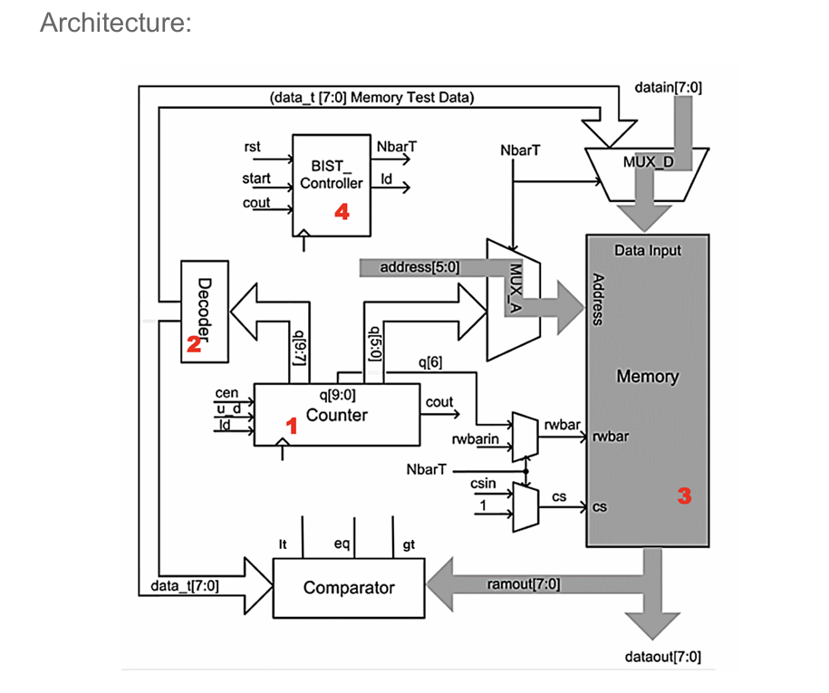

# MBIST System for 64×8 SRAM

Designed and implemented a complete **Memory Built-In Self-Test (MBIST)** system in SystemVerilog for a 64×8 single-port SRAM, covering RTL design, verification, and timing closure under synthesis constraints .

------

## Key Results

- Built full MBIST pipeline: **pattern generation → write → read → compare → fail detection**

- Achieved **successful detection of SRAM faults** (stuck-at, pattern-based)

- Completed **full-chip integration and verification** using VCS

- Closed timing at **6 ns clock (≈166 MHz)** with **non-negative setup slack**

- Delivered synthesizable RTL with constraint-driven optimization

  

------

## Technical Contributions

- Designed modular RTL components:
  - FSM-based controller (test sequencing)
  - parameterized counter (address + pattern control)
  - decoder (test pattern generation)
  - comparator (data validation)
  - multiplexers (mode switching)
  - synchronous SRAM model
- Implemented **dual-mode operation**:
  - normal memory access
  - autonomous BIST testing
- Developed **fault detection logic** based on real-time comparison during read cycles
- Built comprehensive **testbenches**, including fault injection scenarios

------

## Timing & STA

- Applied full SDC constraint set:
  - clock period:1. 63ns
  - input/output delays, clock uncertainty, fanout limits 
- Performed **Static Timing Analysis (STA)** in Design Compiler

**Outcome:**

- Initial design showed **setup violations (negative slack)**
- Optimized design achieved **timing closure (0.1ns>slack ≥ 0)**

------

## Optimization Highlights

- Reduced **critical path delay** by simplifying combinational logic
- Controlled **fanout** to limit signal propagation delay
- Improved datapath structure to avoid long logic chains
- Balanced constraint settings (load, uncertainty) for realistic timing

------

## Tools & Stack

- SystemVerilog (RTL)
- Synopsys VCS (simulation)
- Synopsys Design Compiler (synthesis + STA)
- SDC constraint modeling

------

## Impact

- Demonstrates **end-to-end hardware design flow**:
   RTL → verification → synthesis → timing closure
- Strong focus on **real-world constraints (STA, setup timing, slack optimization)**
- Applicable to **ASIC / FPGA verification and design roles**